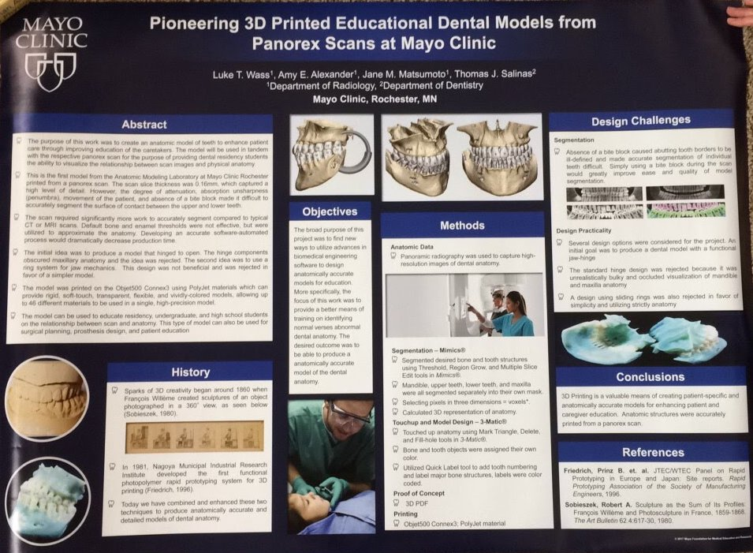
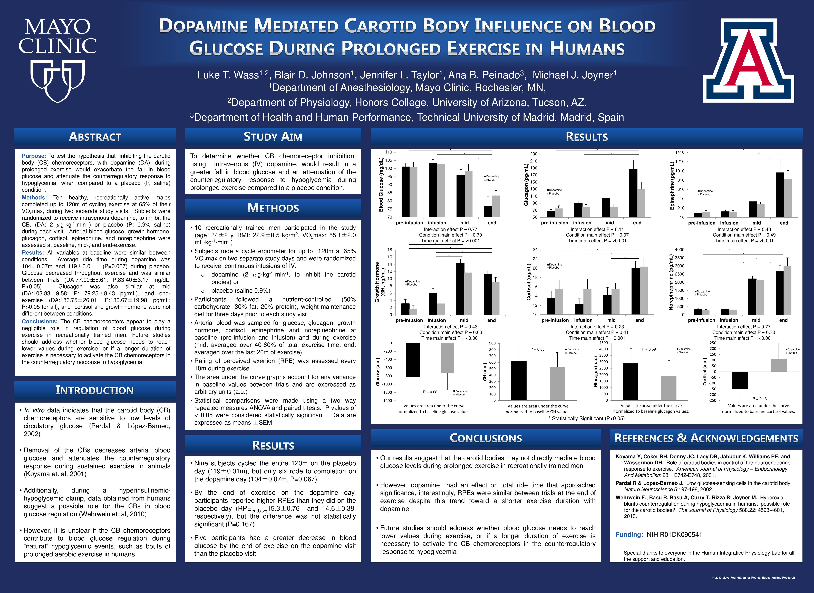

<!--  -->

# Luke Wass, BSN, RN, CCRN

## About

Critical care nurse with six years of ICU experience in high-acuity environments across the U.S. Demonstrates a strong commitment to excellence in patient care, clinical education, and professional advancement through collaborative innovation. Actively pursuing nurse anesthesia to deliver safe, evidence-based, and compassionate care.

## Specialized in

Care of critically ill patients from a wide range of surgical and medical specialties, including thoracic, vascular, orthopedic, plastics, urology, ENT, oral and maxillofacial, and interventional radiology procedures such as lytic therapy. Additional experience with cardiovascular surgery, neurosurgery, trauma, and complex medical cases.

## Research interests

Alcohol withdrawal, traumatic brain injury management, ICU delirium, enhanced clinical education, sport and performance physiology, integrated bedside technologies, workplace optimization, and leveraging AI in healthcare.

## Education

`2016 - 2019`
**BS Nursing, University of Minnesota**

`2012 - 2015`
**BSHS Physiology, University of Arizona College of Medicine**

`2010 - 2012, 2014, 2016`
**Rochester Community and Technical College**

## Certifications
ACLS, BLS, CCRN, NIHSS, TNCC, CMC (examination in July)

## Honors and Awards

`2023` **Daisy Award** *Rochester, MN*  
> A special honor given to extraordinary nurses for compassionate contributions going above and beyond expectations in science and sensitivity. Nominated for delivering exceptional, compassionate care to patients and demonstrating clinical excellence in patient-centered care.

`2014` **Gamma Beta Phi Honors Society** *University of Arizona*  
> National academic honor and service organization recognizing academic excellence and community engagement.

`2014` **Dean's List** *University of Arizona*  
> Earned for maintaining a GPA above 3.5 during full-time enrollment.

`2014` **Mayo Clinic Dependent Scholarship** *Rochester, MN*  
> Merit-based academic scholarship awarded to top 10–25% of eligible applicants based on standardized test performance and academic achievement.

`2013` **Mayo Clinic Summer Undergraduate Research Fellowship (SURF)** *Rochester, MN*
> Competitive research fellowship awarded to high-achieving undergraduate students nationwide. Provided immersive experience in biomedical research under the mentorship of Mayo Clinic investigators. Selected based on academic excellence, research potential, and commitment to scientific inquiry.

`2012` **Honors College** *University of Arizona*  
> The university’s academically rigorous Honors College based on academic performance and potential.

`2012` **University of Arizona Excellence Scholarship** *Tucson, AZ*  
> A merit-based academic scholarship awarded to top-performing incoming students based on standardized test scores, GPA, and academic achievement. Recognizes outstanding potential for collegiate success and leadership.

`2011` **Phi Theta Kappa International Honor Society** *Rochester Community and Technical College*  
> International honor society recognizing academic excellence among two-year college students; invitation based on GPA and leadership potential.

`2010 - Present` **Eagle Scout with double Silver Palms** *Boy Scouts of America*  
> Earning two Silver Palms represents continued leadership, community service, and merit beyond the Eagle rank. Fewer than 1% of Scouts achieve this distinction.

`2007` **First Degree Black Belt** *American TaeKwonDo Association*
> Demonstrates years of disciplined training, mastery of technique, and mental focus. Reflects a strong commitment to perseverance, goal setting, and personal growth—qualities that directly translate to excellence in high-stakes clinical environments.

## Leadership

`2013 - 2015` **Bible Study Leader** *University of Arizona Campus Navigators*

> Gained recruiting and follow-up skills. Prepared study ahead of time, grew in leadership ability through weekly leaders meetings, and lead the men through study each week. Experienced mentorship as both mentor and mentee.

`2010` **Senior Patrol Leader** *Troop 102, Boy Scouts of America*

> Responsible for running a fully functional troop. Coordinated all troop functions: communicated via email and phone with the scouts, parents, and event sponsors; planned and carried out weekly troop meetings and monthly Patrol Leaders Council meetings, and organized all aspects of camping trips. Created a website to aid in up-to-date communication.

`2010` **Eagle Scout Service Project**

> Petitioned friends and local churches for bikes of any condition to be donated. Cleaned and tuned-up the bikes. Requested local bike shops to match each bike donation with a helmet for the rider. Bikes were donated to the InterFaith Hospitality Network of Greater Rochester Minnesota which benefited from the project in that the bikes went to families in the network’s community follow-along program, families who now live in apartments but often don’t have cars of their own. The bikes provided families a way of getting to work and their children a bike to call their own. Demonstrated leadership of others throughout the planned project work days and demonstrated checking, cleaning, fixing/replacing, and waxing the bikes. Roughly 60 hours total.

## Institutional & Editorial Roles

`2025` **Editor in Chief** *CCRN Question Bank, StatPearls*

> Ensure clinical accuracy, relevance, and alignment of CCRN questions with current exam standards. Review and revise question content for clarity and educational value. Write new high-yield items to address gaps and maintain comprehensive coverage of core critical care topics.

`2025` **Repeatable Room Design workgroup** *Mayo Clinic, Rochester, MN*

> Bringing bedside nursing insights and cutting-edge innovative ideas for building the future of Mayo Clinic's patient experience, specifically targeting inpatient room design.

`2025` **Quality Committee** *Mayo Clinic, Rochester, MN*

> Improving care plan and nursing shift note completion by implementing fast, accurate, patient-specific, and efficient note templates.
## Research & Technical Experience

`2015 - 2017` **3D Anatomic Modeling Laboratories** *Mayo Clinic, Rochester, MN*

**Drs. Matsumoto and Morris**

> Utilized computed tomography image datasets to generate a stereolithography file and use photopolymer materials to create 3D models for pre-operational use by the surgeons. The models are extremely beneficial for planning the operation procedure as well as for helping the patient better understand the surgery. Pioneered a project prototyping for thoracic facet joint injection and epidurals, created the Anatomic Modeling Unit’s first dental educational model from a Panorex scan for residency students, and designed an educational foot model. Roughly 15 hours a week.

`2013` **Human Integrative Physiology Laboratory** *Mayo Clinic, Rochester, MN*

Summer Undergraduate Research Fellowship (SURF Program)

**Dr. Joyner, Principal Investigator**

> Studied the effect of inhibiting the carotid bodies in humans with dopamine on blood glucose regulation during prolonged exercise in Dr. Michael Joyner’s Human Integrative Physiology Laboratory. Gained technical skills by assisting with experimental setup for the project as well as setup for other studies. Read protocols and other information for the study and some of the others as well. Assisted with carrying out the studies, including manually recording specific study variables, monitoring and working with study equipment, and interacting with the subject and the others helping to run the study. Learned how to transfer data from the recording software to Excel for organization and analysis of the data. Learned how to generate statistical comparisons using two way repeated-measures ANOVA and paired t-tests. Attended weekly (or more frequently, depending on the week) seminars and grand rounds to sit in and learn about the growing research fields. Roughly 50 hours a week.

## Publications

<!-- A list is also available [online](http://scholar.google.co.uk/citations?user=LTOTl0YAAAAJ) -->

### Poster Presentations

Wass, L. T., Alexander, A. E., Matsumoto, J. M., Salinas, T. J., Department of Radiology, Mayo Clinic, Rochester, MN, & Department of Dentistry, Mayo Clinic, Rochester, MN (2017). <i>Pioneering 3D Printed Educational Dental Models From Panorex Scans At Mayo Clinic</i> [Poster presentation]. Mayo Clinic, Rochester, MN, United States.

<!--  -->

Wass, L. T., Johnson, B. D., Taylor, J. L., Peinado, A. B., Joyner, M. J., Department of Anesthesiology, Mayo Clinic, Rochester, MN, Department of Physiology, Honors College, University of Arizona, Tucson, AZ, & Department of Health and Human Performance, Technical University of Madrid, Madrid, Spain (2013). <i>Dopamine Mediated Carotid Body Influence On Blood Glucose During Prolonged Exercise In Humans</i> [Poster presentation]. Summer Undergraduate Research Fellowship, Mayo Clinic, Rochester, MN, United States.

<!--  -->

<!-- ### Patents

`2012`
Infinitesimal calculus for solutions to physics problems, [SMBC](http://www.techdirt.com/articles/20121011/09312820678/if-patents-had-been-around-time-newton.shtml) patent 001 -->

## Occupation

`January 2026 - Present` **Clinical Research Unit Registered Nurse** *Mayo Clinic, Rochester, MN*

- Supported inpatient and outpatient research protocols across two campuses, including complex assessments, blood draws, ECGs, and monitoring for high-intensity trials.
- Administered moderate sedation for specialized procedures such as endoscopies and colonoscopies.
- Collaborated with multidisciplinary teams to activate new studies, maintain compliance with nursing flowsheets, and ensure seamless patient care in a dynamic research environment.

---

`Spring 2024` **ICU Nursing Clinical Adjunct Instructor**  

*St. Ambrose University – Nano Nagle Online School of Nursing*  

- Provided ICU clinical instruction for LPN-to-RN students.  
- Provided mentorship in critical thinking, evidence-based practice, and clinical documentation.  
- Delivered interactive content on ventilator management, sedation protocols, arterial blood gas interpretation, and ICU workflows.  

---

`March 2024 – January 2025` **SICU Registered Nurse (Temporary Permanent Staff)** *Monument Health Rapid City Regional Hospital, SD*  

- Cared for post-surgical patients in a high-acuity cardiovascular surgical ICU.  
- Delivered comprehensive care for primarily cardiovascular, neurosurgical, and trauma cases.  
- Precepted new nurses and travelers; ensured safe and timely onboarding.  

---

`July 2023 – February 2024` **SICU Registered Nurse (Travel)** *Monument Health Rapid City Regional Hospital, Rapid City, SD*

- See above.  

---

`March 2023 – July 2023` **MICU Registered Nurse (Travel)** *Good Samaritan Hospital, Puyallup, WA*

- Provided care for critically ill medical ICU patients, including respiratory failure, sepsis, and multi-organ dysfunction.  

---

`March 2022 – June 2022` **MICU Registered Nurse (Travel)** *Northern Light Maine Coast Memorial Hospital, Ellsworth, ME*

- Delivered high-quality care in a community hospital ICU setting.  
- Managed central lines, arterial lines, and advanced airway support.  
- Interpreted ECG strips on all ICU and telemetry patients by hand twice a shift.
- Served as preceptor and charge nurse.  
- Adapted quickly to Cerner for travel nurse contract, demonstrating flexibility and strong learning ability in a new EHR system.  
- Recognized for rapid adaptability and teamwork in variable staffing roles.  

---

`March 2022 – Present` **Multi-Specialty SICU Registered Nurse (PRN)** *Mayo Clinic, St Marys Campus, Rochester, MN*

- Float to all ICUs, including thoracic, vascular, cardiac medical, cardiac surgical, neurosurgical, trauma, and medical units.
- Assist with managing patient care during conscious and moderate sedation. 

---

`July 2019 – March 2022` **Multi-Specialty SICU Registered Nurse (Staff)** *Mayo Clinic, St Marys Campus, Rochester, MN*

- Delivered critical care to post-op surgical patients in a level-1 trauma center.
- Served as preceptor and charge nurse.
- Proficient in Epic EMR and ICU documentation standards.

---

## Professional Development

`2024` **COVID-19 Pulmonary and Ventilator Care Micro-Credential** *American Association of Critical-Care Nurses*

## Volunteering

| Service | Hours |
| :-------| ----: |
| Senior Citizen Service | 47 |
| Channel One Food Drive | 16 |
| Harvest Call Food Packaging | 9 |
| Salvation Army Bell Ringing	| 8 |
| Home Health Care Assistance | 6 |
| In His Name Food Drive for greater Rochester, MN area | 6 |
| HopeFest Tucson: Medical Escort | 5 |
| Feed My Starving Children | 2.5 |

<!-- ### Footer

Last updated: January 2025 -->
